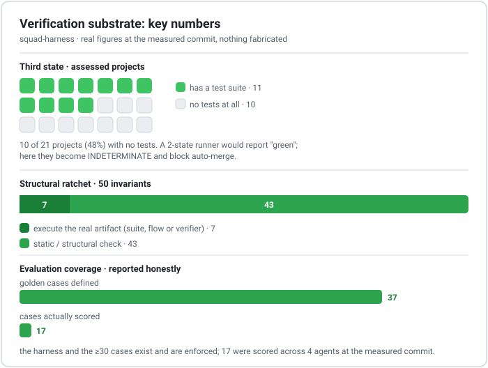

# Verification-First Governance for LLM Agent Systems

> Treating agent output with the skepticism of continuous integration.

[Português](README.md) · **English**

This repository holds a preprint and sanitized illustrative material for a design pattern
observed in a production multi-agent system we call **business-agents**: a **verification
substrate** that sits beneath the (conventional) company-of-agents organization and keeps it
honest.

The central claim is deliberately narrow:

> The organizational layer of multi-agent systems (roles, coordinators, personas) is commodity.
> The verification layer beneath it is under-explored, and making **"not measured" a first-class
> outcome** is the single most valuable design decision in the system.

<picture>
  <source media="(prefers-color-scheme: dark)" srcset="figures/panel-dark.en.svg">
  
</picture>

## The five mechanisms

1. **The third state.** Every gate returns pass / fail / *indeterminate*. "Not measured" is never
   rounded to "passed"; indeterminate is a distinct exit code and never auto-merges.
2. **The defect-ledger ratchet.** An LLM-free gate of 50 invariants, each provenance-linked to
   a real, previously confirmed defect. Verification prefers *executing the artifact* over
   *string-matching its text* ("mention does not prove existence").
3. **The closing loop.** Each confirmed defect is compiled into either a new mechanical invariant
   or a new behavioral evaluation case, so audits raise a floor instead of aging into a report.
4. **Prompt-change governance.** Prompt edits ship only through a property-based
   evaluation-regression gate. Prompts are code under test.
5. **Untrusted context.** Agent-authored content injected back into the model is framed as
   reference, not instruction, and scanned for injection patterns.

## Read the paper

- Português (primary): [`paper.md`](paper.md) - full preprint (v1.0).
- English: [`paper.en.md`](paper.en.md) - full preprint (v1.0).
- Online (GitHub Pages): https://tedfernandes.github.io/business-agents-research/

## Status and honesty note

This is a **preprint / experience report**, not peer-reviewed work, from a **single-operator**
deployment. The evaluation separates mechanisms that are *fully exercised* from those merely
*wired*, and states threats to validity plainly (N=1, self-reported, author is also evaluator).
See Sections 5 and 6 of the paper.

No client data, production-security detail, or verbatim operational configuration appears here.
All figures are anonymized and all code excerpts are sanitized illustrations of mechanism.

## Citing

Author: Ted Fernandes ([ORCID 0009-0006-7522-326X](https://orcid.org/0009-0006-7522-326X)).

A `CITATION.cff` is provided (GitHub renders a "Cite this repository" button). DOI (concept, all
versions): [10.5281/zenodo.22481935](https://doi.org/10.5281/zenodo.22481935).

## License

- **Prose** (`paper.md`, `paper.en.md`, this README): [CC BY 4.0](https://creativecommons.org/licenses/by/4.0/).
- **Code snippets** (illustrative): [MIT](LICENSE).
