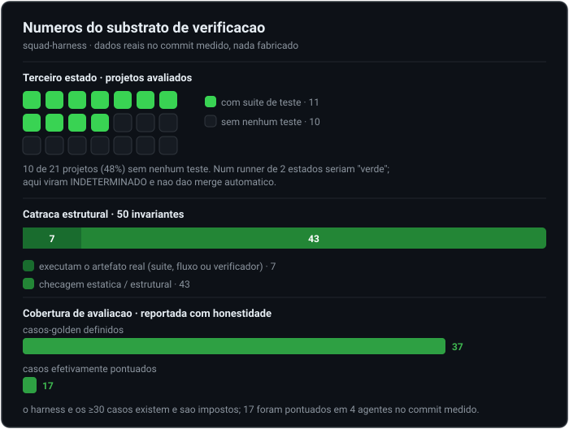

# Governança de Verificação em Sistemas de Agentes LLM

> Tratando a saída do agente com o ceticismo da integração contínua.

*Idioma: **Português** · [English](README.en.md)*

    

Este repositório reúne um preprint e material ilustrativo sanitizado de um padrão de projeto
observado num sistema multiagente em produção que chamamos de **business-agents**: um
**substrato de verificação** montado por baixo da (convencional) organização de "empresa de
agentes", que a mantém honesta.

A tese, propositalmente estreita:

> A camada organizacional dos sistemas multiagente (papéis, coordenadores, personas) é
> commodity. A camada de verificação por baixo dela é pouco explorada, e fazer do
> **"não medido" um resultado de primeira classe** é a decisão de projeto mais valiosa do
> sistema.

## Os cinco mecanismos

1. **O terceiro estado.** Todo gate devolve passou / falhou / *indeterminado*. "Não medido"
   nunca é arredondado para "passou"; indeterminado é um código de saída distinto e nunca dá
   merge automático.
2. **A catraca de defeitos.** Um gate sem LLM com 50 invariantes, cada uma rastreável a um
   defeito real já confirmado. A verificação prefere *executar o artefato* a *casar o texto*
   dele ("menção não prova existência").
3. **O loop que fecha.** Todo defeito confirmado é compilado em uma invariante mecânica nova
   ou em um caso de avaliação comportamental novo, então auditorias elevam um piso em vez de
   virar relatório que envelhece.
4. **Governança de mudança de prompt.** Edições de prompt só sobem por um gate de regressão
   de avaliação por propriedade. Prompt é código sob teste.
5. **Contexto não-confiável.** Conteúdo escrito por agente e reinjetado no modelo é tratado
   como referência, não instrução, e escaneado por padrão de injeção.

## Ler o paper

- Português (principal): [`paper.md`](paper.md) - preprint completo (v1.0).
- English: [`paper.en.md`](paper.en.md) - full preprint, English (v1.0).
- Online (GitHub Pages): https://tedfernandes.github.io/business-agents-research/

## Status e nota de honestidade

Este é um **preprint / relato de experiência**, sem revisão por pares, de uma implantação de
**um único operador**. A avaliação separa os mecanismos *plenamente exercitados* dos apenas
*cabeados* e declara as ameaças à validade com clareza (N=1, auto-relato, o autor também é o
avaliador). Ver Seções 5 e 6 do paper.

Nenhum dado de cliente, detalhe de segurança de produção ou configuração operacional literal
aparece aqui. Todos os números são anonimizados e os trechos de código são ilustrações
sanitizadas de mecanismo.

## Citação

Autor: Ted Fernandes ([ORCID 0009-0006-7522-326X](https://orcid.org/0009-0006-7522-326X)).

Há um `CITATION.cff` (o GitHub mostra o botão "Cite this repository"). DOI (concept, todas as
versões): [10.5281/zenodo.22481935](https://doi.org/10.5281/zenodo.22481935).

## Licença

- **Prosa** (`paper.md`, `paper.en.md`, este README): [CC BY 4.0](https://creativecommons.org/licenses/by/4.0/).
- **Trechos de código** (ilustrativos): [MIT](LICENSE).
