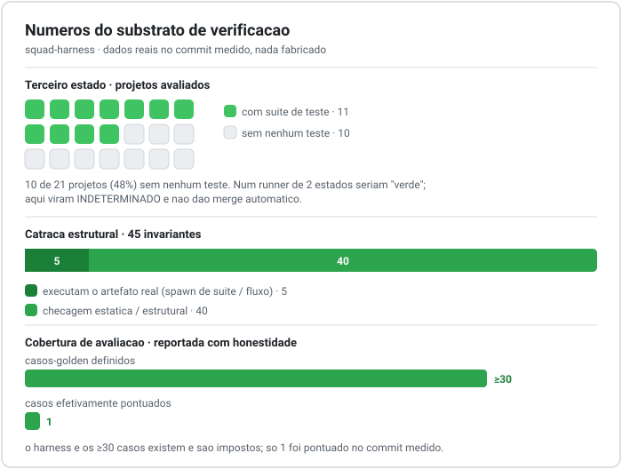

# Governança de Verificação em Sistemas de Agentes LLM: tratando a saída do agente com o ceticismo da integração contínua

**Ted Fernandes**
Pesquisador e praticante independente
`tedfernandes@gmail.com`
ORCID: [0009-0006-7522-326X](https://orcid.org/0009-0006-7522-326X)

*Preprint, versão 1.0 (2026-09). Relato de experiência / artigo de sistemas.*

*(English version: [`paper.en.md`](paper.en.md).)*

---

## Resumo

Frameworks multiagente baseados em grandes modelos de linguagem (LLMs) convergiram para um mesmo desenho: uma empresa de agentes especializados por papel, coordenados rumo a um objetivo. Essa metáfora organizacional já está consolidada (MetaGPT, ChatDev, CrewAI, AutoGen). O que continua pouco endereçado é um problema mais difícil: **como um sistema desses verifica a própria saída, e como ele evita reportar sucesso quando nada foi de fato checado?** Relatamos um sistema de agentes em produção que chamamos de "squad-harness", que opera um portfólio real de cerca de 36 projetos de software e marketing, de 6 clientes, tocado por um único operador humano. A contribuição que distingue o sistema não é sua organização de 23 agentes em três times, que é convencional, mas um **substrato de verificação** montado por baixo dela. Descrevemos cinco mecanismos: (1) um *terceiro estado* de resultado ("indeterminado"), imposto em todos os gates, que codifica a regra de que ausência de medição nunca é aprovação; (2) uma *catraca de defeitos*, um gate sem LLM com 45 invariantes, em que cada invariante é rastreável a um defeito real já confirmado, e em que a verificação prefere *executar o artefato* a *casar o texto* dele; (3) um *loop de aprendizado que fecha*, no qual todo defeito confirmado é compilado em uma invariante mecânica nova ou em um caso de avaliação comportamental novo, de modo que auditorias elevam um piso de forma monotônica; (4) *governança de mudança de prompt* via gates de regressão de avaliação por propriedade, tratando prompts como código sob teste; e (5) tratamento *não-confiável por padrão* do conteúdo escrito por agente que é reinjetado no modelo. Damos uma avaliação franca, ancorada nos próprios artefatos do sistema, incluindo os mecanismos que estão plenamente exercitados e os que não estão, e discutimos as ameaças à validade com honestidade: este é um sistema de um único operador, com dados auto-relatados. Nossa reivindicação é estreita e, defendemos, sustentável: a camada organizacional dos sistemas de agentes é commodity; a camada de verificação é onde a disciplina de engenharia, e o espaço de projeto interessante, de fato vivem.

**Palavras-chave:** agentes LLM, sistemas multiagente, engenharia de software, verificação, avaliação, governança de agentes, relato de experiência.

---

## 1. Introdução

O padrão dominante em sistemas de agentes LLM é a orquestração: um coordenador decompõe uma tarefa, roteia subtarefas para agentes especializados por papel e compõe as saídas deles. Frameworks como MetaGPT [1], ChatDev [2], AutoGen [3], CrewAI [4] e LangGraph [5] tornam esse padrão fácil de construir. A metáfora de "uma software house feita de agentes" é, a esta altura, um exercício de projeto resolvido.

Há um modo de falha mais silencioso que esses frameworks em geral herdam em vez de resolver. **Um sistema de agentes que orquestra mas não verifica vai reportar sucesso, com confiança, sobre um trabalho que nunca checou.** Quando um agente termina uma tarefa de código num repositório sem suíte de testes, o resultado ingênuo é binário: passou ou falhou. "Nada foi verificado" é silenciosamente arredondado para "passou", um pull request abre e, com merge automático ligado, código não verificado vai para produção. O problema não é os agentes serem pouco confiáveis; é o *contrato de reporte* ter só dois estados onde precisa de três.

Este artigo relata um sistema em produção, que chamamos de *squad-harness*, construído para tocar um portfólio real e gerador de receita, e não um benchmark. Ao longo de aproximadamente um ano de uso diário, seu centro de gravidade migrou dos agentes para a maquinaria que mantém os agentes honestos. Fazemos uma reivindicação explícita e propositalmente estreita:

> A camada organizacional dos sistemas multiagente (papéis, coordenadores, personas) é commodity e não é uma contribuição de pesquisa. O **substrato de governança de verificação** por baixo dela, porém, é pouco explorado, e a disciplina específica de fazer do "não medido" um resultado de primeira classe é ao mesmo tempo generalizável e, na nossa experiência, a decisão de projeto mais valiosa do sistema.

Somos francos que este é um *relato de experiência* de uma implantação de um único operador, não um estudo controlado. A Seção 6 trata diretamente das ameaças à validade que disso decorrem. Nossa contribuição é um padrão de projeto e uma prova de existência funcionando, apoiada nos artefatos longitudinais do próprio sistema, e não uma alegação de desempenho medida em benchmark.

## 2. Trabalhos relacionados

**Orquestração multiagente.** O MetaGPT [1] codifica procedimentos operacionais padrão sobre papéis (gerente de produto, arquiteto, engenheiro, QA), e o ChatDev [2] enquadra o desenvolvimento como uma empresa virtual que avança por fases. O AutoGen [3] oferece agentes conversáveis e chat em grupo; o CrewAI [4] traz "crews" por papel, com processo sequencial ou hierárquico; o LangGraph [5] expõe a orquestração de agente/estado como grafo. A estrutura de três times com coordenador do nosso sistema está exatamente nesse espaço, e não reivindicamos novidade por ela.

**Reflexão e memória.** O Reflexion [6] faz o agente refletir verbalmente sobre falhas para melhorar tentativas seguintes; os Generative Agents [7] mantêm um fluxo de memória com reflexão; o MemGPT [8] gerencia memória de longo prazo como um sistema em camadas. Isso estabelece que agentes podem aprender com os próprios traços. Nosso loop de aprendizado difere em *onde a lição aterrissa*: em vez de ir para um armazém de memória recuperável, um defeito confirmado é compilado em uma invariante mecânica ou em um teste de regressão, de modo que a melhoria é imposta por um gate, não meramente disponível para consulta.

**Avaliação de agentes e de prompts.** O SWE-bench [9] e afins medem taxa de sucesso em tarefas; ferramentas como promptfoo e LangSmith [10] fornecem harness de avaliação de prompt/agente. Elas costumam ser aplicadas *externamente*, para medir um sistema. Nós, em vez disso, cabeamos avaliação por propriedade *dentro do caminho de release* dos próprios agentes: uma mudança de prompt que regride um caso-golden não pode ir ao ar.

**Gates de engenharia de software.** Integração contínua (CI), invariantes e suítes de regressão são práticas consolidadas. A contribuição aqui não é inventar gates, e sim *virá-los para dentro*: aplicar o ceticismo de um CI à configuração e à saída de um sistema de agentes, e tratar os próprios artefatos escritos pelo agente como entrada não-confiável.

A lacuna que atacamos fica entre essas literaturas: frameworks de orquestração assumem que a verificação é problema do usuário; ferramentas de avaliação ficam fora do sistema em execução; reflexão melhora o comportamento sem impô-lo de forma dura. Relatamos como é fazer da verificação a espinha do sistema.

## 3. Contexto do sistema (implantação, não contribuição)

O *squad-harness* é um plugin para um runtime de agentes (Claude Code) e é composto por 23 agentes em três times (10 de engenharia, 8 de marketing, 5 de diretoria), cada time liderado por um coordenador, todos respondendo a um único operador humano que age como autoridade de decisão. Ele traz 35 "skills" procedurais (procedimentos executáveis com gates explícitos, não trechos de prompt) e um conjunto de ferramentas: um gate estrutural, um runner de tarefa headless, hooks de git e de ciclo de vida, um harness de avaliação e um gate de paridade de publicação. O sistema toca um portfólio vivo de aproximadamente 36 projetos, de 6 clientes.

Descrevemos isso apenas como o ambiente em que os mecanismos abaixo foram forjados. O desenho organizacional propositalmente *não* é a reivindicação. Para proteger terceiros, todos os números deste artigo são anonimizados: nenhum detalhe de cliente, projeto ou segurança de produção da implantação aparece aqui, e os trechos de código são ilustrações sanitizadas de mecanismo, não configuração literal.

## 4. O substrato de verificação

### 4.1 O terceiro estado: ausência de medição nunca é aprovação

Todo gate do sistema reporta um de **três** resultados, não dois: passou, falhou ou *indeterminado*. Indeterminado é o resultado quando a checagem não pôde de fato rodar, por exemplo uma tarefa de código num repositório que não define script de lint, type-check nem teste. A máxima que governa isso, repetida literalmente pelo código, é *"pular não é passar"* e *"ausência de medição nunca é sinal positivo"*.

As consequências são mecânicas, não conselhos. O runner de tarefa headless, quando não encontra gate para executar, não devolve sucesso; devolve um veredito indeterminado, rotula o pull request resultante como não verificado e se recusa a habilitar merge automático. Indeterminado é um código de saída de processo distinto (2), separado de passou (0) e falhou (1), justamente para que a automação que o embrulha e o CI não confundam "não checado" com "checado e ok".

```text
# Núcleo de decisão do runner de tarefa (sanitizado)
gate = run_gate(projeto)          # {passou, indeterminado}
veredito = ler_veredito_revisor(texto_review)  # APROVA | APROVA_COM_RESSALVA | REPROVA | ILEGIVEL | AUSENTE

bloqueia = veredito in {REPROVA, ILEGIVEL, AUSENTE}
entrega  = (gate.passou or gate.indeterminado) and not bloqueia
automerge = gate.passou and veredito == APROVA   # indeterminado NUNCA dá merge automático

exit_code = 0 if entrega else (1 if bloqueia else 2)   # 2 == indeterminado, um estado real
```

Dois detalhes importam para a honestidade do reporte. Primeiro, o parser de veredito do revisor é *fail-closed*: um veredito ilegível ou ausente é tratado como bloqueio, não como aprovação, porque um regex permissivo já casou apenas o `REPROVA` cru e perdeu variantes formatadas como `**VEREDITO:** REPROVA`, um defeito achado por revisão adversarial. Segundo, indeterminado nunca entra no loop de auto-correção, porque não há saída de erro a consertar; o sistema não fabrica atividade para disfarçar a ausência de sinal.

### 4.2 A catraca de defeitos: menção não prova existência

O gate estrutural ("a catraca") é um programa sem LLM que roda em segundos e checa **45 invariantes** sobre a própria fonte do sistema. Sua propriedade definidora está declarada no cabeçalho: *toda invariante existe porque um defeito real foi confirmado e fechado, e todo achado mecanicamente verificável entra aqui.* A catraca é, portanto, um livro-razão legível por máquina das falhas passadas do sistema; o número de invariantes cresce de forma monotônica à medida que defeitos são achados e corrigidos.

As invariantes cobrem integridade estrutural (existem exatamente 23 agentes; todo comando declarado no manifesto parseia; nenhum caractere de controle invisível na fonte), integridade de gate (o runner nunca devolve sucesso em gate vazio; regras de permissão protetivas seguem intactas contra um snapshot versionado) e higiene de deploy (hooks da branch publicada existem; main local e remota são o mesmo commit).

A subpropriedade mais importante é expressa no código como *"casa a propriedade, não a frase"*. Várias invariantes **executam o artefato real** em vez de casar o texto da fonte. A invariante do parser de veredito roda a própria suíte de testes do parser; a invariante do guarda de segurança executa o guarda contra uma lista de operações que ele deve bloquear e outra que ele não deve; a invariante ponta a ponta roda o fluxo inteiro de tarefa contra um repositório temporário real, com o modelo dublado. Essa escolha de projeto foi ela mesma dirigida por defeito: uma invariante de casamento de texto reportou "verde" duas vezes sobre um refactor correto cujo texto apenas mudara, e, mais grave, uma mutação de código passou 22 de 22 testes unitários enquanto falhava ponta a ponta. A lição, de que citar um comportamento não prova que o comportamento existe, recorre tanto no livro-razão que suas ocorrências são contadas em comentário.

### 4.3 O loop que fecha: auditorias elevam um piso

O sistema registra lições por um procedimento de retrospectiva que destila um incidente em uma a três regras atômicas (`sintoma -> causa -> regra`), escritas num arquivo de aprendizados de nível de projeto ou de portfólio. Um hook de início de sessão reinjeta esses aprendizados no contexto do modelo, e um hook de parada, sem bloquear, cutuca o operador se uma sessão que tocou código não registrou nenhuma lição.

O passo que fecha o loop, e que consideramos o cerne, é este: **uma lição derivada de um defeito confirmado ganha um segundo destino, mecânico.** Se o defeito é mecanicamente verificável, ele vira uma invariante nova na catraca (Seção 4.2). Se é comportamental, vira um caso-golden novo na suíte de avaliação (Seção 4.4). Uma retrospectiva que termina só em prosa é tratada como incompleta. O efeito é que cada auditoria não apenas produz um relatório que envelhece; ela eleva um piso a partir do qual a próxima sessão começa. O arquivo de aprendizados também é podado contra um teto numérico por uma ferramenta dedicada, que nunca apaga sozinha (o custo de perder uma lição real é assimétrico) e que devolve *indeterminado*, de novo o terceiro estado, quando não encontra nada mensurável.

### 4.4 Governança de mudança de prompt: prompt como código sob teste

Agentes não podem editar as próprias definições. Uma mudança de prompt passa por um único caminho com gate: o harness de avaliação registra uma linha de base, a mudança é aplicada e o harness repontua. A comparação é **por propriedade, não por texto literal**: cada caso-golden carrega uma rubrica de três a oito itens verificáveis e um "anti-exemplo" que zera o caso se violado; a nota de um caso não pode cair. Reescrever uma resposta correta ainda deve passar; reintroduzir o defeito original ainda deve falhar; e *remover cobertura conta como regressão*. O harness também avisa quando o hash do prompt está inalterado entre duas medições, isto é, quando um prompt foi comparado consigo mesmo por acidente. Uma regressão bloqueia a mudança.

Reportamos o estado desse mecanismo com honestidade na Seção 5: o harness e o corpus de casos-golden existem e são impostos estruturalmente, mas o corpus de *execuções pontuadas registradas* no commit medido é pequeno.

### 4.5 O envelope de entrega: handoff estruturado e autocético

Todo agente devolve trabalho em um envelope fixo de nove linhas, validado por um script que o *consumidor* roda antes de agir ("não confira no olho, rode"). Além dos campos de proveniência e verificação, o envelope força uma partição em três de todo entregável: (1) o que está feito, (2) o que ficou deliberadamente fora de escopo e (3) o que está pendente ou incerto. A própria documentação do sistema chama a terceira parte de "a mais importante". Trabalho que chega sem a evidência prometida não é arredondado para pronto; entra na entrega explicitamente rotulado como "não verificado", atribuído ao agente que o produziu. Isso é disciplina de verificação expressa na fronteira entre agentes, não só nos gates.

## 5. Avaliação



*Figura 1. Números reais do substrato de verificação no commit medido. Nada fabricado.*

Avaliamos contra os próprios artefatos do sistema. Separamos os mecanismos *plenamente exercitados* dos *definidos, mas pouco exercitados*, porque confundir os dois violaria o próprio princípio que o sistema encarna.

**Catraca estrutural (plenamente exercitada).** No commit medido, a catraca impõe 45 invariantes, cada uma rastreável a um defeito confirmado. Como o livro-razão só cresce, a taxa de reincidência de um defeito *já corrigido e registrado* é, por construção, zero: uma regressão retrip a sua invariante antes da publicação. Um subconjunto das invariantes executa o artefato real (suíte do parser, suíte do guarda, fluxo ponta a ponta) em vez de casar texto; elas existem justamente porque variantes de casamento de texto produziram falsos "verdes" no passado.

**O terceiro estado (plenamente exercitado, alto impacto).** O terceiro estado é o mecanismo que conseguimos defender de forma mais concreta. Num snapshot medido do portfólio, **10 de 21 projetos avaliados continham zero arquivo de teste.** Um runner de agente de dois estados teria, portanto, reportado "verde" para trabalho que não conseguia verificar em cerca de 48% dos projetos avaliados. Fazer do indeterminado um resultado de primeira classe converte essa mentira silenciosa num rótulo explícito e visível, e bloqueia o merge automático exatamente nesses projetos. Consideramos esse único número o argumento empírico mais forte do artigo.

**Executar em vez de mencionar (plenamente exercitado, atestado por defeito).** Dois defeitos concretos são atribuíveis a esse princípio: (a) um parser de veredito do revisor que perdia reprovações formatadas, achado por revisão adversarial e agora guardado por um teste executado; e (b) uma mutação que passou em todos os testes unitários mas falhou no fluxo ponta a ponta, o que motivou a invariante ponta a ponta. Ambos estão registrados no código, não reconstruídos para este artigo.

**Harness de regressão de avaliação (definido, pouco exercitado).** O harness, o formato de caso-golden e a comparação por propriedade estão implementados e impostos (uma invariante estrutural exige ao menos 30 casos-golden entre os agentes). Contudo, no commit medido, o armazém de notas registradas contém um único caso pontuado (um cenário de engenharia de QA, "projeto sem suíte de testes", com nota 0.5 de 1.0, linha de base igual à atual). O mecanismo é real e cabeado no caminho de release; sua *cobertura exercitada* é pequena. Reportamos isso de propósito: é exatamente o tipo de lacuna que a própria disciplina de terceiro estado do sistema nos proíbe de arredondar para cima.

**Loop de aprendizado (plenamente exercitado no nível de mecanismo).** A compilação de retrospectiva em invariante é observável diretamente: o crescimento da catraca é a saída do loop, já que as invariantes são a forma compilada dos defeitos confirmados. A metade comportamental do loop (retrospectiva em caso de avaliação) compartilha a limitação de cobertura apontada acima.

## 6. Ameaças à validade

Esta é uma implantação de um único operador, com dados auto-relatados; o autor é também o avaliador. Não há linha de base controlada nem replicação independente, então todas as alegações são de existência e de mecanismo, não de desempenho comparado. O portfólio é heterogêneo, porém pequeno (~36 projetos, 6 clientes) e vindo da prática de um único operador, o que limita a validade externa. O sistema é construído sobre um runtime de agentes, então alguns mecanismos podem ser específicos do substrato, não universais. O harness de regressão de avaliação é pouco exercitado (Seção 5), então alegações sobre seu efeito na qualidade dos prompts se limitam ao seu desenho, não ao seu impacto medido. Por fim, como o autor projetou tanto o sistema quanto suas autochecagens, as invariantes podem codificar tanto os pontos cegos do autor quanto suas lições; o livro-razão registra os defeitos que foram *achados*, que não é o mesmo que os defeitos que *existem*. Declaramos esses limites com clareza porque a tese do artigo é honestidade de verificação, e seria autorrefutável exagerar.

## 7. Discussão

Duas observações generalizam além desta implantação. Primeira, a disciplina de três estados é barata e portátil: qualquer pipeline de agente que emita passou/falhou binário pode adicionar um estado indeterminado e uma regra de nunca autoaprovar nele, e fazer isso converte uma classe de falhas silenciosas em falhas visíveis. Segunda, uma catraca de defeitos reformula a confiabilidade do agente como um ativo que se acumula, e não uma aposta por execução: o artefato interessante não é a saída de nenhum agente isolado, mas o conjunto crescente de checagens de máquina que impedem que defeitos corrigidos voltem em silêncio.

Também observamos o que *não* é um fosso defensável. O elenco de agentes, as personas e as skills procedurais são configuração e engenharia de prompt; são replicáveis. O runtime não é nosso. O que se acumula, e é difícil de copiar, é o livro-razão de defeitos reais e a disciplina de compilar cada um deles numa checagem imposta. Isso é capital operacional, não um primitivo técnico, e achamos mais útil nomeá-lo assim do que alegar o contrário.

## 8. Conclusão

A metáfora da empresa de agentes está resolvida. A questão aberta, e mais consequente, é como esses sistemas verificam a si mesmos. Relatamos um sistema em produção cujo centro de gravidade é um substrato de verificação: um estado indeterminado de primeira classe, para que "não medido" nunca seja "passou"; uma catraca sem LLM de 45 invariantes com proveniência de defeito, que preferem executar um artefato a citá-lo; um loop que compila cada defeito confirmado numa checagem imposta; mudanças de prompt guardadas por regressão por propriedade; e conteúdo escrito por agente tratado como não-confiável. Avaliamos com franqueza, separando o que está exercitado do que está apenas cabeado, e localizamos o valor real e não-portátil no livro-razão de defeitos acumulado, e não nos agentes. Nossa recomendação a quem constrói sistemas de agentes é simples e, acreditamos, subvalorizada: trate a saída dos seus agentes como um sistema de CI maduro trata um build, e faça do "eu não checei" um estado que você é estruturalmente proibido de esconder.

## Disponibilidade

Trechos ilustrativos sanitizados e este artigo estão disponíveis no repositório que acompanha o texto. Nenhum dado de cliente, detalhe de segurança de produção ou configuração operacional literal está incluído, por desenho.

## Referências

[1] S. Hong et al. "MetaGPT: Meta Programming for a Multi-Agent Collaborative Framework." ICLR, 2024.
[2] C. Qian et al. "ChatDev: Communicative Agents for Software Development." 2023.
[3] Q. Wu et al. "AutoGen: Enabling Next-Gen LLM Applications via Multi-Agent Conversation." 2023.
[4] CrewAI: framework para orquestrar agentes autônomos por papel. Framework de software, 2023-.
[5] LangGraph: framework de orquestração de baixo nível para aplicações LLM multi-ator com estado. LangChain, 2024-.
[6] N. Shinn et al. "Reflexion: Language Agents with Verbal Reinforcement Learning." NeurIPS, 2023.
[7] J. S. Park et al. "Generative Agents: Interactive Simulacra of Human Behavior." UIST, 2023.
[8] C. Packer et al. "MemGPT: Towards LLMs as Operating Systems." 2023.
[9] C. E. Jimenez et al. "SWE-bench: Can Language Models Resolve Real-World GitHub Issues?" ICLR, 2024.
[10] promptfoo e LangSmith: ferramentas de avaliação de LLM, open-source e comercial. Recursos web, 2023-.

---

*Este é um preprint e não passou por revisão por pares. Feedback pelas issues do repositório é bem-vindo.*
